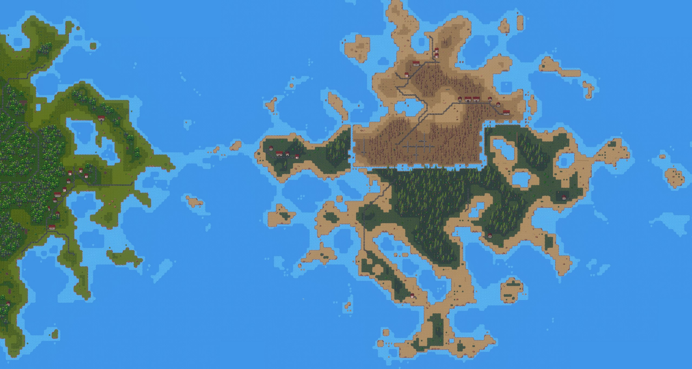
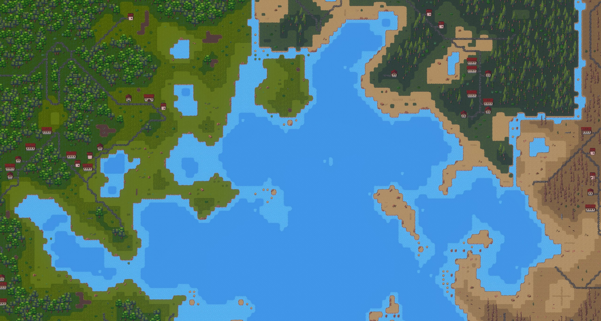
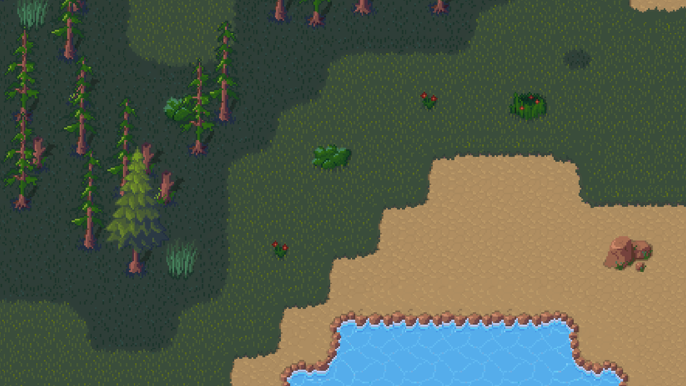
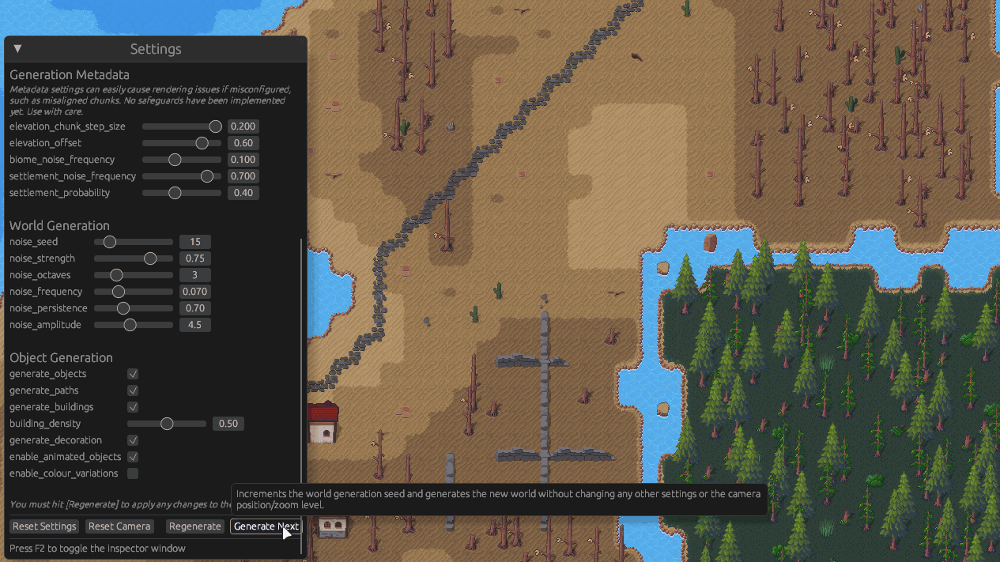
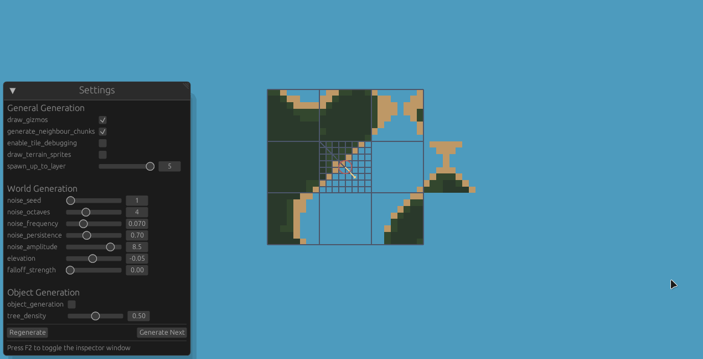

# Procedural Generation Project 2

This repository contains basic generation logic for a 2D, pixel art, tile set-based world. It was written in Rust,
using Bevy engine (v0.19). The purpose of this project was to familiarise myself a little more with Rust and
procedural generation. It's a follow-up on my first attempt to learn
Rust, [Rusteroids](https://github.com/kimgoetzke/rusteroids),
and my first, non-Rust procedural generation
project, [Procedural Generation Project 1](https://github.com/kimgoetzke/procedural-generation-1).
You will neither find advanced concepts of Rust being applied (correctly) here nor advanced procedural generation
techniques.

## Demo

## Features

- Generates an infinite and animated, 2D pixel art world that is fully deterministic
- Executes generation processes asynchronously (excluding entity spawning, of course)
- Terrain generation:
    - Uses **multi-fractal Perlin noise** to generate terrain layers
    - Features 3 biomes (dry, moderate, humid), each with 5 terrain types (water, shore, and three land layers e.g.
      sand/grass/forest)
    - Each terrain type supports 16 different tile types, many with transparency allowing for smooth
      transitions and layering
    - Uses a chunk-based approach (as can be seen in the GIFs)
    - Employs **contextual layers** (`Metadata`) to make chunks context aware, allowing for gradual elevation
      changes over great distances and inter-chunk biome changes without reducing generation performance
- Object generation:
    - Uses a basic **A\* pathfinding** algorithm implementation to generate paths crossing multiple chunks
    - Generates 3 modular building types - each allowing for different door locations, and window/roofs styles - in
      settled areas along paths
    - Uses the **wave function collapse** algorithm to generate additional decorative objects such as trees, ruins,
      stones, etc.
    - Supports multi-tile objects and connected objects, the rules for which are expressed in `.toml` files -
      for example, ruins can span multiple tiles and span over multiple terrain types
- Features 32x32px sprites (or sprites that fit within a 32x32px grid) that were created by me
- `bevy-inspector-egui` plugin to play around with the generation parameters at runtime
- `iyes_perf_ui` plugin for performance metrics in an overlay

## Attribution

- Art work is somewhat inspired by [sanctumpixel](https://sanctumpixel.itch.io/)'s style
- All sprites were created by myself and are available under [CC BY 4.0](https://creativecommons.org/licenses/by/4.0/)

## How to use

> [!NOTE]
> When you start the application, the default settings will result in no land or objects being spawned at the
> origin `cg(0, 0)`, so you'll have to move the camera in any direction to see something.

- `A`/`D`/`W`/`S` to move the camera
- Hold `Shift` to move camera faster
-  `PageUp`/`PageDown` or use mouse wheel to zoom in/out
- `T`/`F6` to reset the camera's zoom level (and rotation) but not its position
- `R`/`F5` to regenerate the world with the current settings
- `Right Click` a tile to show and log its debug info
- `F1` to toggle world inspector UI
- `F2` to toggle settings
- `F11` to toggle fullscreen/windowed mode
- `Z` to toggle performance metrics overlay
- `X` to toggle debug gizmos
- `C` to toggle tile debug info being displayed

## How to develop

### Looking at the codebase for the first time or haven't looked at it in a while?

- Start with the `GenerationStage` enum in conjunction with the `world_generation_system` in `GenerationPipelinePlugin`
- which is driving the generation process
- The terrain/world generation which generates chunks and tiles sits in `crate::generation::world`
- The object generation which generates paths, settlements, and decorative objects placed on the terrain lives in
  `crate::generation::object`
- Resources used for both of the above can be found in `crate::generation::generation_resources`
- Structs and enums used across multiple modules sit in `crate::generation::model`

### Want to know more?

See the [/docs](/docs) folder.