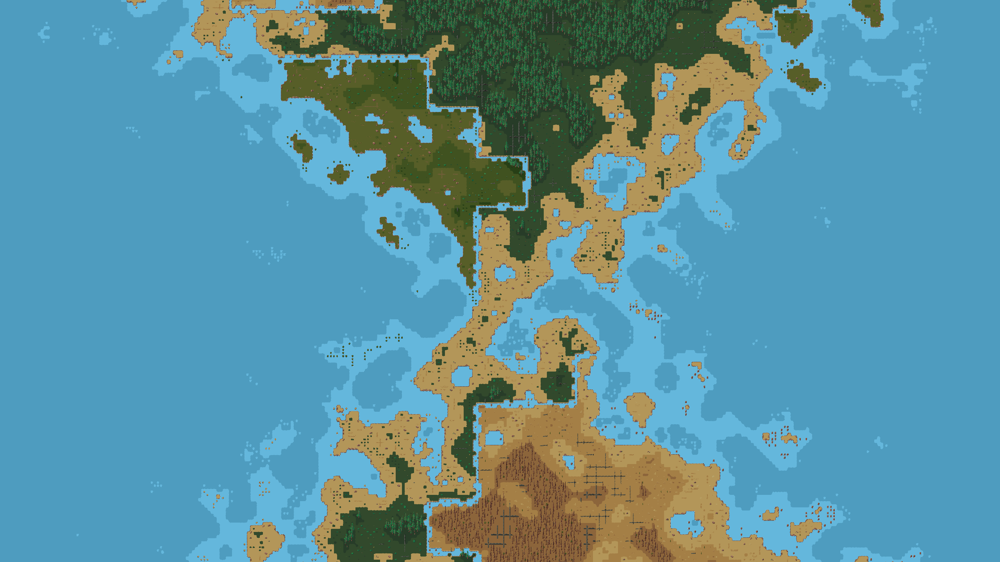
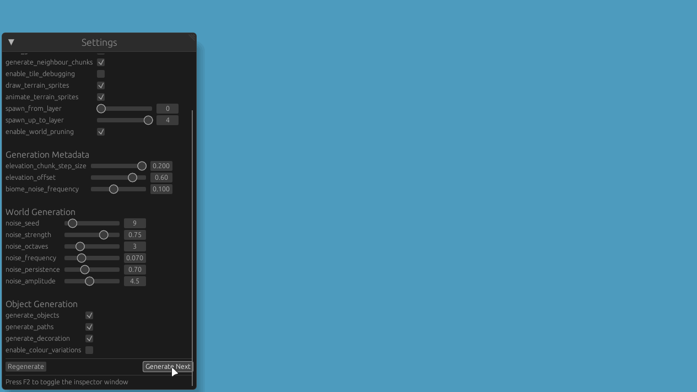
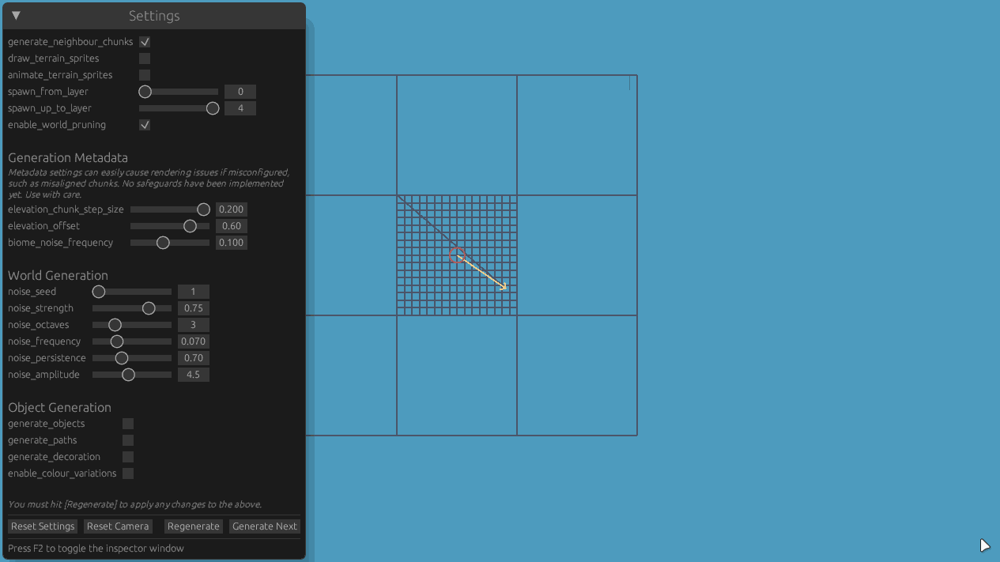

# Procedural Generation Project 2

This repository contains basic generation logic for a 2D, pixel art, tile set-based world. It was written in Rust,
using Bevy engine. The purpose of this project was to familiarise myself a little more with Rust and procedural
generation. It's a follow-up on my first attempt to learn Rust, [Rusteroids](https://github.com/kimgoetzke/rusteroids),
and my first, non-Rust procedural generation
project, [Procedural Generation Project 1](https://github.com/kimgoetzke/procedural-generation-1).
You will neither find advanced concepts of Rust being applied (correctly) here nor advanced procedural generation
techniques.

> [!NOTE]
> I'm still actively working on this. Parts of what I want to do is still missing and, at times, I may even leave
> it in a broken state.

## Demo

## Features

- Generates an infinite and animated, 2D pixel art world
- Executes generation processes asynchronously (excluding entity spawning, of course)
- Terrain generation:
    - Uses multi-fractal Perlin noise to generate terrain layers
    - Features 3 biomes (dry, moderate, humid), each with 5 terrain types (water, shore, sand, grass, forest)
    - Each terrain type supports 16 different tile types, many with transparency allowing for smooth
      transitions/layering
    - Uses a deterministic chunk-based approach (as can be seen in the GIFs)
    - Employs contextual layers (`Metadata`) to make chunks context aware, allowing for gradual elevation
      changes over great distances and inter-chunk biome changes without reducing generation performance
- Object generation:
    - Uses the wave function collapse algorithm to generate objects such as trees, ruins, stones, etc.
    - Supports multi-tile objects and connected objects, the rules for which are expressed in `.ron` files -
      for example, ruins can span multiple tiles and span over multiple terrain types
- Features 32x32px sprites (or sprites that fit within a 32x32px grid) that were created by me
- `bevy-inspector-egui` plugin to play around with the generation parameters at runtime
- `bevy-pancam` plugin for free camera movement

## Attribution

- Art work is heavily inspired by [sanctumpixel](https://sanctumpixel.itch.io/)'s style
- All sprites were created by myself and are available under [CC BY 4.0](https://creativecommons.org/licenses/by/4.0/)

## How to develop

### Using Nix Flakes, JetBrains RustRover & Direnv

You can run this project in any way you like, but I have set things up to make it easy to develop using JetBrains
RustRover. For this, you'll need:

- `direnv`
- Any Direnv integration plugin e.g. https://plugins.jetbrains.com/plugin/15285-direnv-integration
- `nix`

This way, you'll just need to `direnv allow` in the project directory after which all prerequisites (incl. Rust, Cargo,
all Bevy dependencies, etc.) will be available to you. The JetBrains plugin will ensure that the environment is
available to your IDE and you can run the project from there (vs `cargo build` and `cargo run` in the terminal).

### Using Nix Flakes

Without `direnv`, you can use the Nix Flake by running `nix develop` in the project directory. If you want to use an IDE
such as JetBrains RustRover, you'll have to set up the environment manually. You'll most likely have to make
`LD_LIBRARY_PATH` available to your IDE.

Upgrade the flake by running `nix flake update` in the repository's base directory.

### Reminders

#### How to add object sprite assets

1. Add the sprite to the relevant sprite sheet in `assets/objects/`
2. Add a new option to the `ObjectName` enum
3. Add the object name to the `any.terrain.ruleset.ron` file (top, right, bottom, left)
4. Add the object name to the `all.tile-type.ruleset.ron` file (like just `Fill`)
5. Add a new state to the relevant `{terrain}.terrain.ruleset.ron` file using the index from the sprite sheet
6. Optional: if this is a large asset, make sure to add it to `ObjectName.is_large_sprite()` too

#### Run configurations

- Create a run configuration with environment variable `RUST_LOG=procedural_generation_2=debug` for debug logs
- Create a run configuration with environment variable
  `RUST_LOG=procedural_generation_2=debug,procedural_generation_2::generation::object=trace` to add WFC trace logs too
