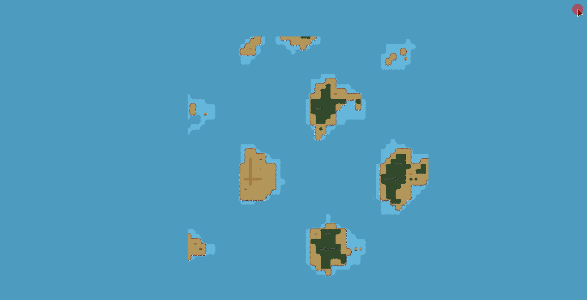

# Procedural Generation Project 2

This repository contains basic generation logic for a 2D, pixel art, tile set-based world. It was written in Rust,
using Bevy engine (v0.16.1). The purpose of this project was to familiarise myself a little more with Rust and
procedural
generation. It's a follow-up on my first attempt to learn Rust, [Rusteroids](https://github.com/kimgoetzke/rusteroids),
and my first, non-Rust procedural generation
project, [Procedural Generation Project 1](https://github.com/kimgoetzke/procedural-generation-1).
You will neither find advanced concepts of Rust being applied (correctly) here nor advanced procedural generation
techniques.

## Demo

[](https://www.youtube.com/watch?v=rdGre9dZdgo)

_The above video has not been updated to feature paths yet._





## Features

- Generates an infinite and animated, 2D pixel art world that is fully deterministic
- Executes generation processes asynchronously (excluding entity spawning, of course)
- Terrain generation:
    - Uses multi-fractal Perlin noise to generate terrain layers
    - Features 3 biomes (dry, moderate, humid), each with 5 terrain types (water, shore, and three land layers e.g.
      sand/grass/forest)
    - Each terrain type supports 16 different tile types, many with transparency allowing for smooth
      transitions and layering
    - Uses a chunk-based approach (as can be seen in the GIFs)
    - Employs contextual layers (`Metadata`) to make chunks context aware, allowing for gradual elevation
      changes over great distances and inter-chunk biome changes without reducing generation performance
- Object generation:
    - Uses a basic A* pathfinding algorithm implementation to generate paths crossing multiple chunks
    - Uses the wave function collapse algorithm to generate additional decorative objects such as trees, ruins,
      stones, etc.
    - Supports multi-tile objects and connected objects, the rules for which are expressed in `.ron` files -
      for example, ruins can span multiple tiles and span over multiple terrain types
- Features 32x32px sprites (or sprites that fit within a 32x32px grid) that were created by me
- `bevy-inspector-egui` plugin to play around with the generation parameters at runtime
- `bevy_pancam` plugin for free camera movement
- `iyes_perf_ui` plugin for performance metrics in an overlay

## Attribution

- Art work is heavily inspired by [sanctumpixel](https://sanctumpixel.itch.io/)'s style
- All sprites were created by myself and are available under [CC BY 4.0](https://creativecommons.org/licenses/by/4.0/)

## How to develop

### Looking at the codebase for the first time or haven't looked at it in a while?

- Start with the `GenerationStage` enum in conjunction with the `world_generation_system` in `GenerationPlugin` which is
  driving the generation process
- The terrain/world generation which generates chunks and tiles sits in `crate::generation::world`
- The object generation which generates paths and decorative objects placed on the terrain lives in
  `crate::generation::object`
- Resources used for both of the above can be found in `crate::generation::resources`
- Structs and enums used across multiple modules sit in `crate::generation::lib`

> [!NOTE]
> When you start the application, the default settings will result in no land or objects being spawned at the
> origin `cg(0, 0)`, so you'll have to move the camera in any direction to see something

### Using Nix Flakes, JetBrains RustRover & Direnv

You can run this project in any way you like, but I have set things up to make it easy to develop using JetBrains
RustRover. For this, you'll need:

- `direnv`
- Any Direnv integration plugin e.g. https://plugins.jetbrains.com/plugin/15285-direnv-integration
- `nix`

This way, you'll just need to `direnv allow` in the project directory after which all prerequisites (incl. Rust, Cargo,
all Bevy dependencies, etc.) will be available to you. The JetBrains plugin will ensure that the environment is
available to your IDE and you can run the project from there (vs `cargo build` and `cargo run` in the terminal).

##### How to deal with RustRover making problems again

RustRover forgetting where the Rust standard library is?

```
find /nix/store -type d -name rust_lib_src
```

### Using Nix Flakes

Without `direnv`, you can use the Nix Flake by running `nix develop` in the project directory. If you want to use an IDE
such as JetBrains RustRover, you'll have to set up the environment manually. You'll most likely have to make
`LD_LIBRARY_PATH` available to your IDE.

Upgrade the flake by running `nix flake update` in the repository's base directory.

### Reminders

#### How to add decorative object sprite assets

1. Add the sprite to the relevant sprite sheet in `assets/objects/`
2. Add a new option to the `ObjectName` enum
3. Add the object name to the `any.terrain.ruleset.ron` file (top, right, bottom, left)
4. Add the object name to the `all.tile-type.ruleset.ron` file (like just `Fill`)
5. Add a new state to the relevant `{terrain}.terrain.ruleset.ron` file using the index from the sprite sheet
6. Optional: If this is a large asset, make sure to add it to `ObjectName.is_large_sprite()` too

#### How to add building or path sprite assets

1. Add the sprite to the relevant sprite sheet in `assets/objects/`
2. Update the column and row values in `constants.rs` for buildings/paths, if necessary
3. Add the new option(s) to the `ObjectName` enum
4. Add the object name(s) to the `is_building()` or `is_path()` function in `object_name.rs`
5. Add the object name(s) to the `get_index_for_building()` or `get_index_for_path()` function in `object_name.rs`
6. Add the object name(s) to the `any.terrain.ruleset.ron` file where appropriate (top, right, bottom, left)
7. If building sprite: Add the object name(s) to relevant `BuildingType` in the `BuildingComponentRegistry`

You can but don't need to update any other ruleset files as buildings and paths are placed prior to decorative objects
and therefore don't need to be considered in the wave function collapse algorithm which uses these rulesets. However,
the addition to the "any ruleset" file results in the neighbouring tile of the new sprite to be empty 
(`ObjectName::Empty`). Without this, you'll see errors in the wave function collapse algorithm.

#### How to use cargo-flamegraph

- Run the command below to generate a flame graph
    - Linux:
      ```shell
      CARGO_PROFILE_RELEASE_DEBUG=true RUSTFLAGS='-C force-frame-pointers=y' cargo flamegraph -c "record -g" --package=procedural-generation-2 --bin=procedural-generation-2
      ```
    - Windows:
      ```pwsh
      $env:CARGO_PROFILE_RELEASE_DEBUG = "true"; $env:RUSTFLAGS = "-C force-frame-pointers=y"; cargo flamegraph -c "record -g" --package=procedural-generation-2 --bin=procedural-generation-2
      ````
- This should run the application - once you close it, a `flamegraph.svg` will be generated at the root of the
  repository
- Open it in your browser to see the flame graph

#### Run configurations

The `.run` folder contains a few run configurations for RustRover. Alternatively, you may want to consider creating:

- A run configuration with environment variable `RUST_LOG=procedural_generation_2=debug` for debug logs
- A run configuration that also appends
  `,procedural_generation_2::generation::object=trace,procedural_generation_2::generation::path=trace` to `RUST_LOG` for
  WFC and pathfinding trace logs
- A run configuration with environment variable `RUST_LOG=bevy_ecs=debug` to see Bevy ECS logs (e.g. which system
  caused an `error[B0003]`)
